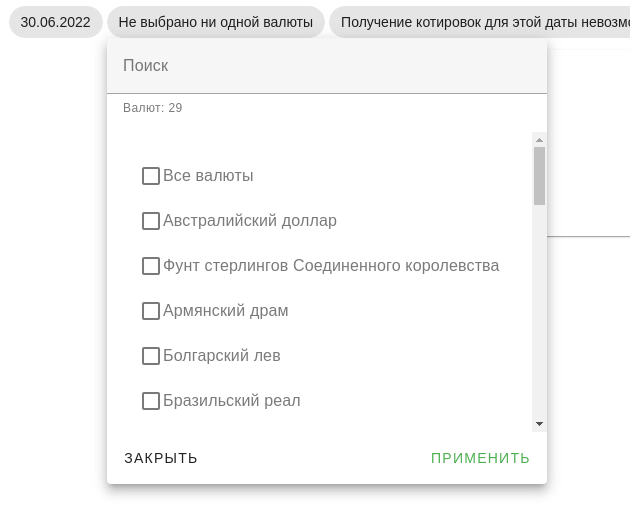

# Currencies


Получение котировок курса валют от [ЦБ РФ](https://www.cbr.ru/).

## Пояснения к проекту

1. В ТЗ написано про кнопку `получить котировку`. Я считаю, что с точки зрения
   юзабилити она излишне.
3. Серверная часть сделана на django/djangorestframwork. Мне graphql больше нравится.
   В этом проекте я решил освежить свои знания именно в этом фреймворке. Хотел проверить генерацию типов.
4. Клиентская часть сделана на nuxt3/vuetify. Было интересно опробовать его в деле, хотя он еще не production ready.
6. Реализовывал `Simple Domain Model` на сервере, на клиенте смысла не вижу, но папку сервисов создал.
8. Двойная отрисовка одного и того же фильтра - это баг nuxt. В nuxt2 такой проблемы
   не наблюдается.


## Генерация типов на клиент с помощью openapi

```shell
sh scripts\generate_types.sh
```

## Фильтрация
Фильтрация даты:


Фильтрация валют:


** Фильтр даты влияет на фильтр валют.

## Виды

Вид, когда не выбрана ни одна валюта


Вид, когда выбрана одна валюта


Вид, когда выбрано много валют


## Выгрузка

Выгрузка в csv


Выгрузка в xlsx


Выгрузка в pdf

